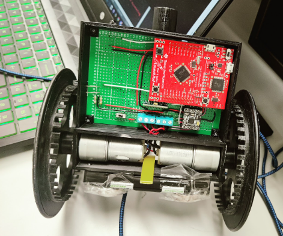
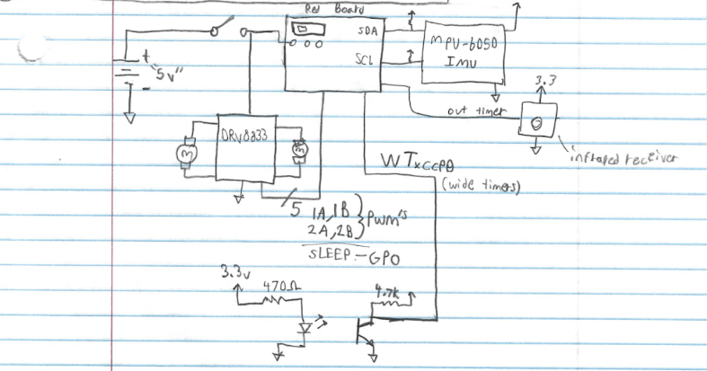
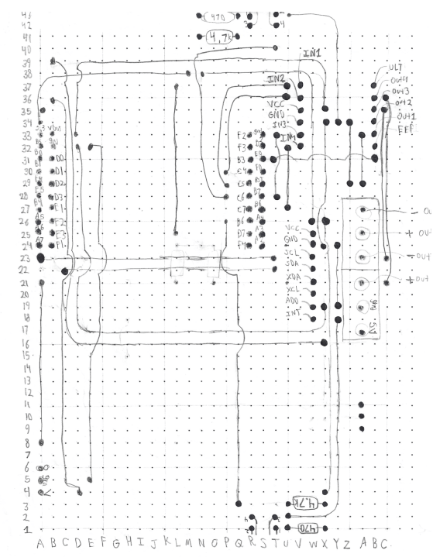

# Two-Wheeled Self-Balancing Robot

## Overview

This project involves the design, development, and creation of a **two-wheeled, self-balancing robot**. The robot is designed to maintain its balance and respond to commands using an **MPU6050 3-axis accelerometer and gyroscope**. The project was completed for the **CSE 4342** course, with the main objective of achieving balance control and precise movement.

## License and Usage

This project was developed as a school assignment, and while the code is provided free to use for learning and reference, it is strictly prohibited to use this code or its derivatives for any academic submission or coursework. Doing so would be considered academic dishonesty and a violation of school policies.

Please feel free to use this project to better understand the concepts used, but respect academic integrity by ensuring it is not submitted for grades.

## Project Requirements and Achievements

### Balance Control
The robot uses the MPU6050’s gyroscope and accelerometer to maintain balance. A **PID controller** was implemented in the `balancePID` interrupt. While the robot can balance when lightly pushed and during 90-degree rotations, it struggles to maintain balance over longer forward and backward movements.

### Straight-Line Motion
By using gyro and odometry data, the robot can move forward and backward with around **90% accuracy**. The motion control is handled by the `pidISR` interrupt, where a PID controller ensures straight movement. Attempts to use optical interrupters for wheel tracking were less reliable, so MPU data was used instead.

### Precise Rotations
Using the gyroscope, the robot can rotate to specific angles with approximately **90% accuracy**. This is achieved in the `rotate` function, which allows for precise control over rotation angles.

### Command-Line Interface (CLI)
A **command-line user interface** was implemented using UART0, allowing interaction with the robot via commands such as:
- `angle` – Displays the current rotation angle.
- `clear` – Resets the current rotation angle.
- `tilt` – Displays the robot’s tilt angle.
- `forward`, `reverse` – Moves the robot 1 meter in either direction.
- `rotate cw`, `rotate ccw` – Rotates the robot 90 degrees clockwise or counterclockwise.

### IR Sensor Control
An **IR sensor** was integrated to control the robot using a remote. Commands such as forward, reverse, and rotate can be issued via the remote, and the robot responds reliably. The IR signal decoding is handled by the `IRdecoder` function.

## Board Layout
The project’s hardware design followed the following Schematic.

